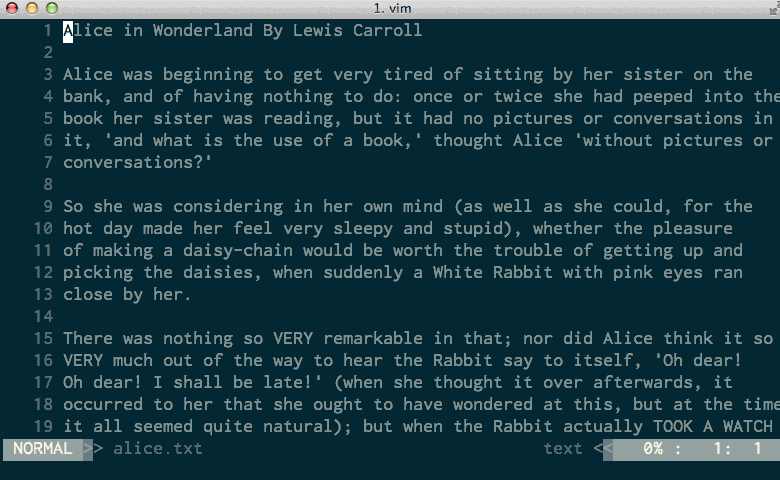
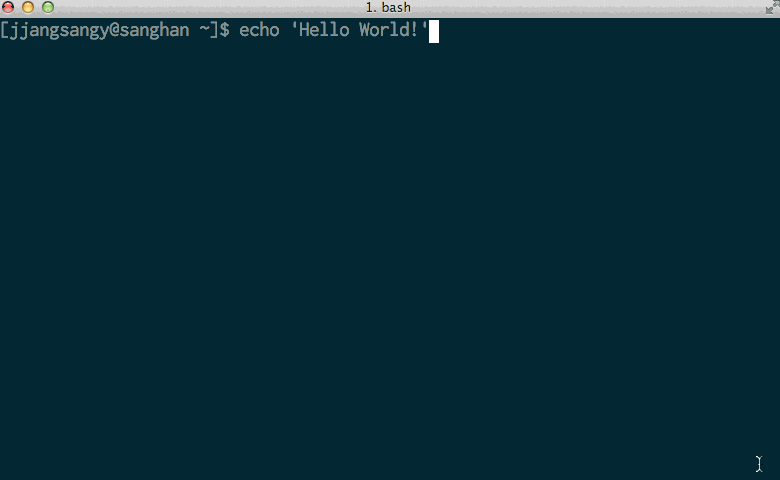

py-translate
=============

.. image:: https://travis-ci.org/jjangsangy/py-translate.svg?branch=master
    :target: https://travis-ci.org/jjangsangy/py-translate

py-translate is a CLI Tool for Google Translate written in Python!

:Author: Sang Han, 2014
:License: Apache Software License v2
:Version: 0.1.1

The end goal is a simple application for translating text in the terminal. 
Text can be generated interactively or programmatically in the shell enviornment. Through command line arguments,
file descriptors or pipes generating translated output that can be piped to a file or displayed on the terminal.

Features
---------
- Simple command line parsing!
- Written in pure Python!
- Backwards compatable with Python 2.7
- Supports all language from Google Translate API
- Speed: Unix Pipes
- Native UTF-8 Support

TODO:
----------------
- Installation through pip package manager

Installation
------------
* Clone the repository

.. code-block:: bash

    $ git clone https://github.com/jjangsangy/py-translate.git

* Install with setup.py

.. code-block:: bash

    $ python setup.py install

Usage
-----
* Default will translate from english to target language
* Pipe from the shell!

.. code-block:: bash

    $ echo 'Hello World!' | translate zh-TW

Documentation
-------------

Documentation is available at https://py-translate.readthedocs.org/
