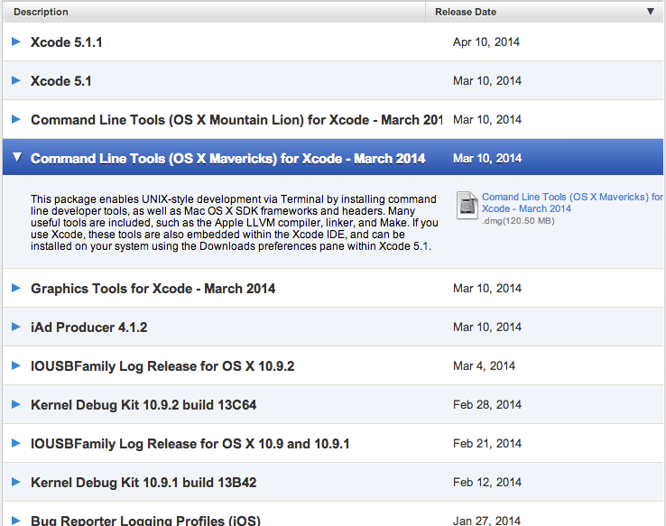

.. _osx:

Mac OS X Full Installation
==========================
Mac OS X is a great development enviornment for python. However, using the
default python installation which comes with the operating system
currently (Mavericks 10.9.2), has many issues in terms of interfacing
with third party applications.

Before we can get hacking. We will need to do 3 things

1. **Get a C Compiler**

   * Install XCode
   * Install GCC using Apples Command Line Tools

2. **Get a Package Manager**

   * Install Homebrew

3. **Install Python**

   * Install your own copy of Python. No more messing with system copy.
   * Install pip

1. Installing XCode or Command Line Tools
-------------------------------------------
By default, Apple does not package OS X with it's own C Compiler.

The default way would be to download and install `XCode <https://developer.apple.com/xcode>`_.
which is free to anyone with an apple account and can be installed through the App Store.

Another option for Lion, Mountain Lion and Mavericks users,
**Apple now provides an official Command Line Tools for Xcode package**
that you can install without needing to install Xcode itself!

You can download it from `Apple's developer site <https://developer.apple.com/downloads/>`_
(free registration required) and search for "Command Line Tools".

2. Install Homebrew
-------------------
Once we have installed GCC and/or command line tools
installing homebrew is very straightforward.

Open up a terminal window and enter

.. code-block:: bash

    $ ruby -e "$(curl -fsSL https://raw.github.com/Homebrew/homebrew/go/install)"

This will install the homebrew package manager in you ``/usr/local/``.

Any packages that you will install, including python can be found
in this directory.

We also need to make sure that ``/usr/local/`` is in our ``$PATH``
enviornment before the ``/bin``. In order to do that, run this command.

.. code-block:: bash

   echo export PATH="/usr/local/bin:$PATH" >> ~/.profile

Now we're all set to start installing some packages!

3. Install Python
------------------
First make sure that homebrew is up to date

.. code-block:: bash

   $ brew update && brew upgrade

   Already up-to-date.

Now we are ready to install python.

.. code-block:: bash

   $ brew install python

.. note:: This will install python 2, not python 3.

To install the latest version of Python 3.

.. code-block:: bash

   $ brew install python3

This will also include pip your python package manager.

First we need to make sure that everything is up to date.

.. code-block:: bash

   $ pip install --upgrade setuptools
   $ pip install --upgrade distribute
   $ pip install --upgrade pip
   $ pip install --upgrade wheel

Now we're all ready, we can install py-translate directly from PyPI

.. code-block:: bash

   $ pip install py-translate

And we're done!
